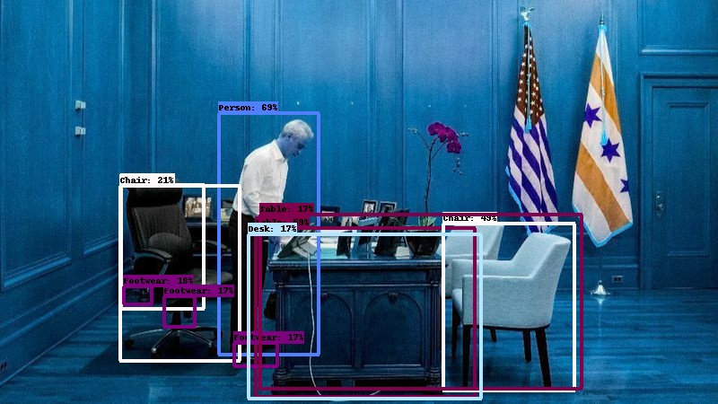

# Object Detection 

Firstly Clone/Download Repository


To run the flask app: 

```
cd loca_path_for_repository/Object_Detection
python app.py
```
Open http://127.0.0.1:5000/ on your browser to see the webpage.

**Model Details**:

*  SSD+MOBILENET_V2 Model Publish by GOOGLE and trained on Openimagesv4 dataset

*  Model uses ImageNet pre-trained MobileNet V2 as image feature extractor.

*  Detections are outputted for 600 boxable categories.

* The MobileNet V2 feature extractor was trained on ImageNet and fine-tuned with SSD head on Open Images V4 dataset, containing 600 classes.

*  link for Model : https://tfhub.dev/google/openimages_v4/ssd/mobilenet_v2/1?tf-hub-format=compressed

**Dataset**:

link=https://github.com/cvdfoundation/open-images-dataset#download-images-with-bounding-boxes-annotations


**Sample results**:



